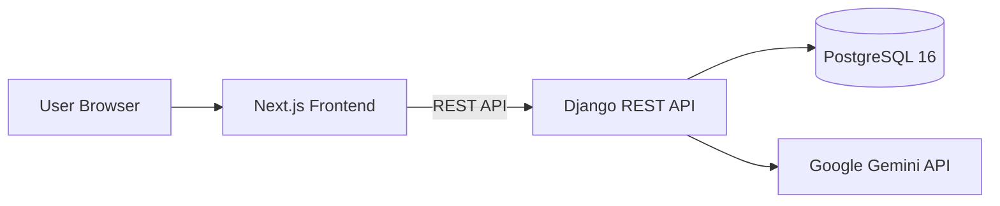

# Padel Discovery AI

Padel Discovery AI is a full-stack MVP for finding padel courts, coaches, and tournaments. It combines a Next.js frontend, a Django REST backend, PostgreSQL, and optional Gemini-powered natural language search.

## What it does

- Browse courts, coaches, and tournaments.
- Search using plain language like “indoor courts near me” or “coaches with beginner lessons”.
- Open detail pages for each listing.
- Use Django Admin to manage records.

## How it works

1. The user opens the Next.js frontend.
2. The frontend calls the Django API for courts, coaches, tournaments, and search results.
3. When a user types a natural-language search, the backend extracts filters.
4. If `GEMINI_API_KEY` is set, Gemini helps interpret the query.
5. If Gemini is unavailable, the backend falls back to built-in heuristic parsing.
6. The backend queries PostgreSQL and returns paginated results.
7. The frontend renders the matching cards and detail pages.

## Architecture



Only the backend talks to the database and Gemini. The frontend only talks to the backend.

## Run

```bash
docker compose up --build
```


## Environment

Copy `.env.example` to `.env` and set:

- `DJANGO_SECRET_KEY` for Django
- `GEMINI_API_KEY` to enable AI search parsing

The app still runs without Gemini; it just uses local parsing rules.

## Seed data

Sample courts, coaches, and tournaments are seeded automatically when the backend starts. You can also run:

```bash
python manage.py seed_data
```

## Docs

- [Setup guide](docs/setup-guide.md)
- [API documentation](docs/api-documentation.md)
- [Security review](docs/security-review.md)
- [Dependency compatibility report](docs/dependency-compatibility-report.md)
- [Architecture diagram](docs/architecture.md)
- [Test instructions](docs/setup-guide.md#testing)
