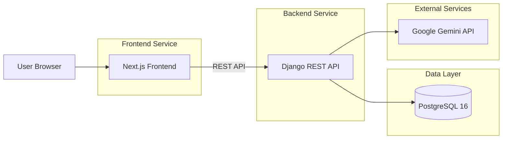

# Architecture

Key points:

- Frontend and backend are separate Docker services.
- The frontend only talks to the backend through REST.
- The backend is the only service with database and Gemini access.
- Admin record management is handled through Django Admin.
